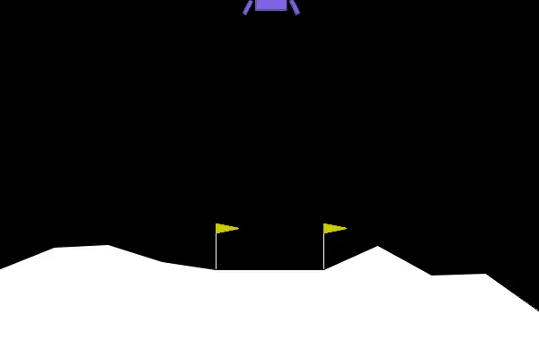

# LunarLander - Reinforcement Learning with PyTorch

Train a DQN agent to land a lunar module using OpenAI Gymnasium and PyTorch.



## Quick Start

### 1. Install Dependencies
```bash
pip install -r requirements.txt
```

### 2. Run One of These Commands

| Command | Action |
|---------|--------|
| `python Runner.py` | Play using trained model |
| `python Learn.py` | Train a new model |
| `python Capture.py` | Record video of agent |

## Files

- **Agent.py** - QNetwork architecture
- **Learn.py** - Train the agent → saves `model/checkpoint.pth`
- **Runner.py** - Load model and play game
- **Capture.py** - Record gameplay video

## Environment Details

[Lunar Lander](https://gymnasium.farama.org/environments/box2d/lunar_lander/) - Box2D environment

### Actions (Discrete 4)
| Code | Action |
|------|--------|
| 0 | Do nothing |
| 1 | Fire left engine |
| 2 | Fire main engine |
| 3 | Fire right engine |

### State (8 values)
| Index | Description |
|-------|-------------|
| 0-1 | X, Y position |
| 2-3 | X, Y velocity |
| 4 | Angle |
| 5 | Angular velocity |
| 6-7 | Left/right leg contact |

## License

BSD
